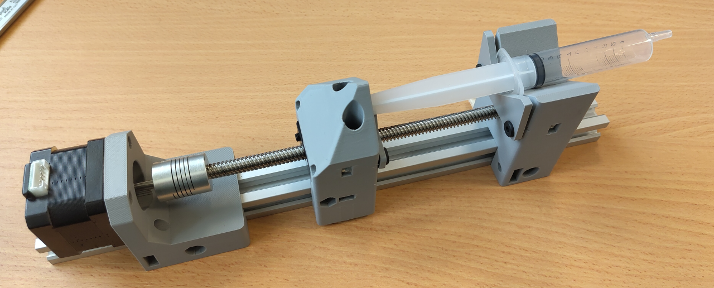

# Modular Syringe Pump
Syringe pump built out of aluminum profile, 3D printed parts and OpenBuilds components. Works with many different syringe sizes.

## Requirements

Before opening the FreeCAD project file, make sure that the **Fasteners Workbench** addon is installed in your FreeCAD installation.

### Installation

1. Open FreeCAD.
2. Go to **Tools → Addon Manager**.
3. Search for **Fasteners Workbench**.
4. Install it and restart FreeCAD if required.

### Important

The project may not load correctly and some components may be missing or generate errors if the Fasteners Workbench is not installed.

